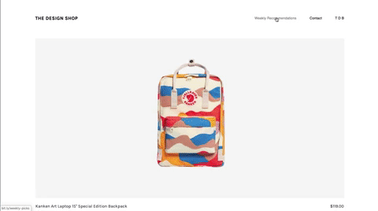
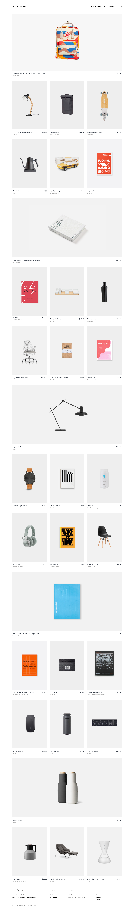

# Aufgabenstellung

Das heutige Projekt ist es einen Online-Shop zu erstellen. Die Produktinformationen findest du in der Datei [products.md](products.md)

Erstelle eine responsive Website!

## Assets

__Font:__ Karla

__Farbe:__ #323A45 / #848484

## Ergebnisvorschau

